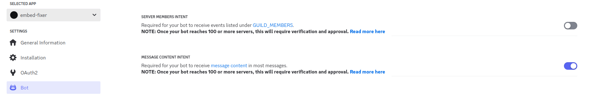
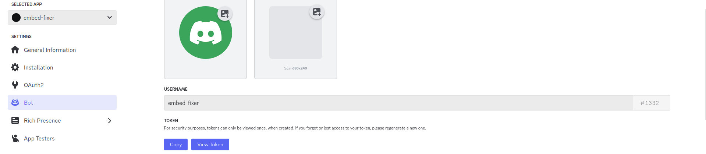

# embed-fixer
Embed fixer is a FOSS Discord bot that modifies specific URLs in messages by replacing them with embed fixed versions of popular social media websites (rxddit.com, ddinstagram.com, vxtwitter.com, koutube.com, vxtiktok.com, fixupx.com) and then re posts the modified message in the channel.

## Create a Discord Bot:

1. Go to the [Discord Developer Portal](https://discord.com/developers/)
2. Create a new application.
3. Create a bot user and get the bot token.
4. Invite the bot to your server with the appropriate permissions (Read and Manage Messages).
5. Enable Message Content Intent under the bot section.



Your DISCORD_BOT_TOKEN can be found here.



## Build pod
```bash
podman build -t embed-fixer .
```

## Run pod
```bash
podman run --network host -e DISCORD_BOT_TOKEN="yourtokenhere" --read-only --cap-drop=ALL --security-opt=no-new-privileges -d --replace --name embed-fixer-container embed-fixer
```

## Pod params
```bash
--network host: Ensures the container uses the host’s network stack, bypassing the need for TUN/TAP devices.
--read-only: Makes the filesystem read-only.
--cap-drop=ALL: Drops all Linux capabilities, ensuring the container runs with the least privileges.
--security-opt=no-new-privileges: Ensures the container processes cannot gain new privileges.
```

## Pod params
```bash
--network host: Ensures the container uses the host’s network stack, bypassing the need for TUN/TAP devices.
--read-only: Makes the filesystem read-only.
--cap-drop=ALL: Drops all Linux capabilities, ensuring the container runs with the least privileges.
--security-opt=no-new-privileges: Ensures the container processes cannot gain new privileges.
```

## Add this bot to your server
[Click here.](https://discord.com/oauth2/authorize?client_id=1255464592390361128)

## Preview

https://github.com/DonW16/embed-fixer/assets/33807357/bf3c029c-b1b6-4888-91ca-480d875ea153

## Donate
- https://buymeacoffee.com/twhalley
- XMR: 84jWayVVFGdSLjGLWSw1cKc4rWsocYz3XEctEggK2m7s6Lw46xirDWMac6NWQgUc5pDKVmTK6QGFbXrzUkDBuinRPRun6f7
- BTC: 3QYqpUdrinrmyJSrdBuTwgXpnYzHt5KaGj
- LTC: MCi1rHR6Yy9crMDxHGgkBgQMxUpFzt55us
- ETH: 0xf1a1929772F6CdC22594B88b53842a4Da594172e
